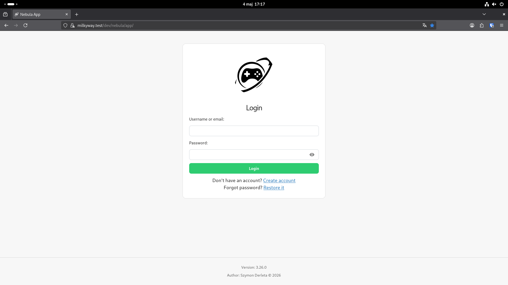
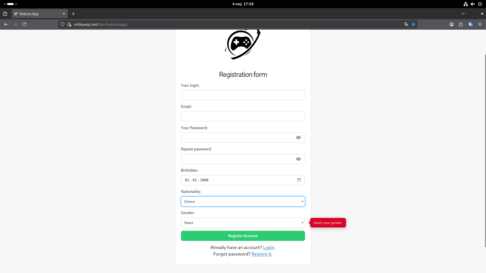
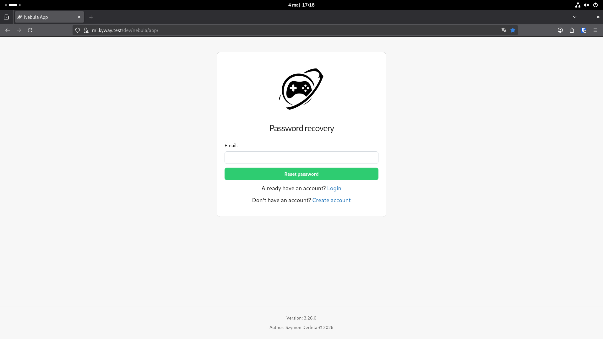
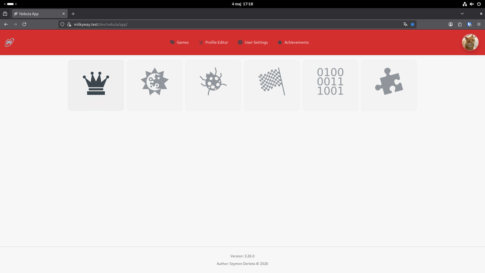
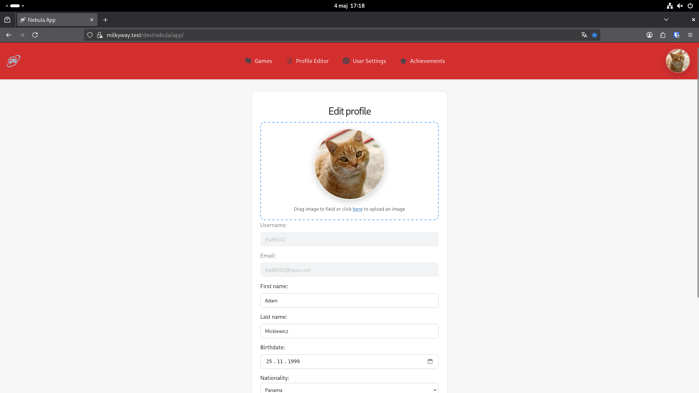
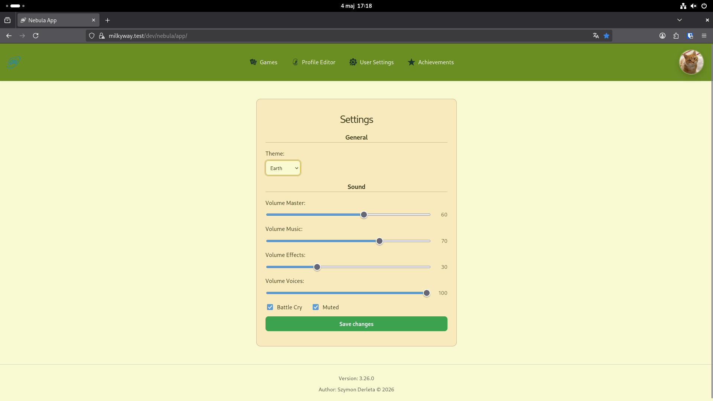
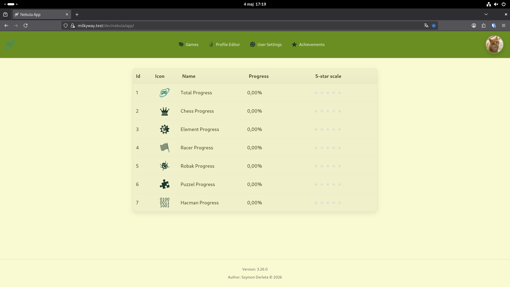
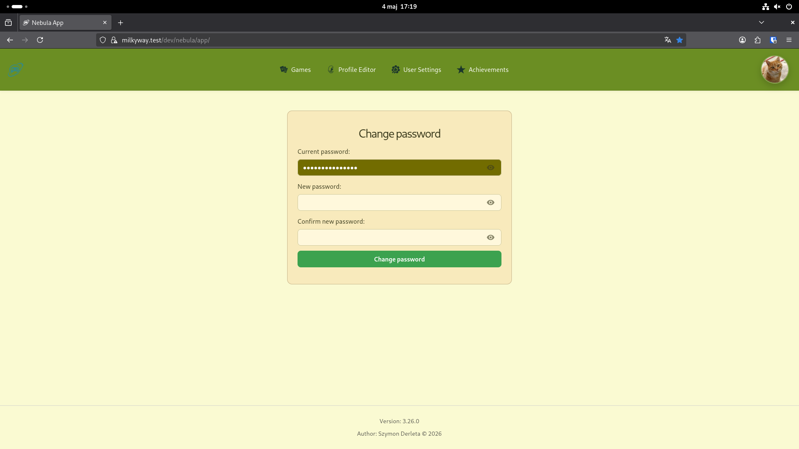

# Nebula Home Frontend

<p align="center">
  <a href="https://github.com/MilkyWay-HomeLabs/nebula-home">
    
  </a>
  
  
  
</p>

<p align="center">
  
  
  
  
  
</p>

---

Apache-2.0 license

Nebula Home Frontend

📖 Documentation

    📄 [Changelog](docs/changelog.md) — project history.
    🚀 [Deployment](docs/deploy.md) — CI/CD and environment configuration.
    🚀 [Routes](docs/routes.md) — detailed application routes description.
    📊 [Metrics](docs/architecture.md) — architecture and monitoring information.
    🧪 [Testing](docs/tests.md) — testing instructions and coverage.
    ❓ [Help](docs/contributing.md) — contributing and troubleshooting.
    🛡️ [Production Ready Checklist](docs/architecture.md) — security and production recommendations.

🌟 Overview

Nebula Home is a specialized frontend application that serves as the central user hub for the MilkyWayHomeLab Nebula ecosystem. It provides users with a comprehensive profile management interface, allowing them to control their personal data and account settings.

Nebula Home acts as a vital bridge between various ecosystem applications and the Andromeda Authorization Server, facilitating seamless user interactions and account lifecycle management.

Key Features

    👤 Profile Management: Update personal information, including display names and other profile details.
    🖼️ Avatar Upload: Support for uploading and updating user profile pictures.
    🔐 Security Settings: Secure password change functionality and account security management.
    📝 User Onboarding: Full support for new account registration and profile initialization.
    🔗 Ecosystem Bridge: Centralized hub connecting users to other Nebula applications and services.
    🛡️ Integrated Authentication: Seamless integration with Andromeda Authorization Server using JWT-based secure sessions and CSRF protection via Spring Security's `CookieCsrfTokenRepository`.
    🎨 Responsive Design: Modern, intuitive UI built with React 19, optimized for all devices.

📸 Preview

<p align="center">
  
  
  
  
  
  
  
  
</p>

Monitoring and Diagnostics

The application provides basic diagnostics and health checks:

    - Built-in error boundaries and logging for monitoring application health.
    - Integration with backend health endpoints for comprehensive system status.

Warning

All API interactions and security configurations should be verified carefully during deployment. Ensure that environment variables and sensitive keys are handled securely. Review authentication flows especially when handling sensitive user data.

🛠️ API Examples

This application communicates with backend services using JWT-based cookies, headers, and CSRF protection.

All state-mutating requests (`POST`, `PATCH`, `PUT`) automatically include the `X-XSRF-TOKEN` header
read from the `XSRF-TOKEN` cookie set by Spring Security's `CookieCsrfTokenRepository`.
If the cookie is absent (e.g. first login), a lightweight `GET` to the backend root is performed first
to obtain the token before proceeding.

> **Backend requirement:** Spring Security 6 must be configured with both
> `CookieCsrfTokenRepository.withHttpOnlyFalse()` **and**
> `CsrfTokenRequestAttributeHandler` (not the default XOR handler).

Example Fetch (Conceptual)

```javascript
fetch('/api/v1/user/profile', {
  credentials: 'include',
  headers: {
    'Authorization': `Bearer ${accessToken}`,
    'X-XSRF-TOKEN': getCsrfToken(),
    'X-Requesting-App': 'nebula_home'
  }
})
```

More examples and detailed route documentation can be found in [docs/routes.md](docs/routes.md).

🏗️ Building the Project

Prerequisites

    Node.js (LTS version)
    npm / yarn

Installation Steps

Clone the Repository

```bash
git clone https://github.com/MilkyWay-HomeLabs/nebula-home.git
cd nebula-home
```

Configuration

Create a `.env` file based on `.env.example`:

```env
# Router base path for BrowserRouter basename
VITE_PUBLIC_URL=/dev/nebula/app/

# Backend API base URL (used for API calls and CSRF token bootstrap)
VITE_REQUEST_URL=https://api.your-nebula.com

# Basic-auth credentials for unauthenticated requests
VITE_USERNAME=your-service-user
VITE_PASSWORD=your-service-password

VITE_TOMCAT_DOMAIN=https://your-nebula.com:8555
VITE_APACHE_DOMAIN=https://your-nebula.com
VITE_RESOURCES_DOMAIN=https://your-nebula.com/resources/
```

Build and Run

```bash
# Install dependencies
npm install

# Run in development mode
npm run dev

# Build for production
npm run build

# Preview production build
npm run preview
```

🚀 Verification

After starting, the development server is typically available at http://localhost:5173. You can verify the setup by accessing the login page.

📄 License

This project is licensed under the Apache License 2.0. See the LICENSE file for the full license text.

👤 Author

Szymon Derleta
GitHub: @szymonderleta

🏠 Project

Organization: @MilkyWay-HomeLabs
Repository: nebula-home
